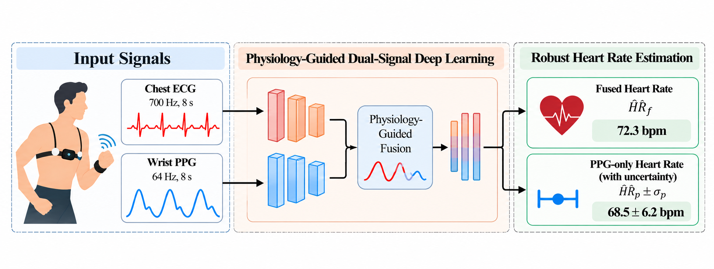
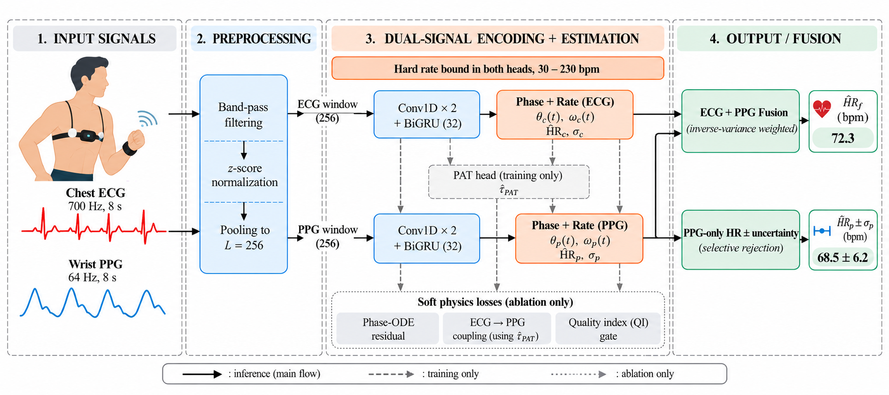

# Physiologically Constrained Phase-Rate Estimation for Motion-Robust Wearable Heart-Rate Sensing

Code for the IEEE Sensors Letters submission *Physiologically Constrained Phase-Rate Estimation for Motion-Robust Wearable Heart-Rate Sensing: Hard Constraints versus Physics-Informed Losses*.

The project asks a simple question: when physiological knowledge is added to a compact heart-rate network, should it be built into the architecture or added to the loss? A phase-rate network is proposed in which heart rate is read from the speed of a latent cardiac phase. That speed is held inside a physiological range (30 to 230 bpm) by a hard constraint, and every estimate comes with a calibrated uncertainty. The same network is then trained with soft physics-informed (PINN) losses for comparison.



## Main findings

- The wrist-only readout reaches **5.70 bpm** mean absolute error under leave-one-subject-out (LOSO) evaluation on PPG-DaLiA, 37.1% lower than a Deep-PPG-style network and 66.8% lower than spectral peak detection, and it is better in all 15 subjects.
- On the unseen WESAD dataset the error is **4.38 bpm**.
- Keeping only the most confident half of the windows lowers the window-level error from 5.61 to **1.96 bpm** (65.1% lower).
- The hard rate bound is required for stable phase dynamics. Soft PINN losses (a phase ODE residual and an ECG-to-PPG coupling) add no accuracy once heart-rate labels are available.
- The wrist branch has 18.5 k parameters and runs in 16.4 ms per 8 s window on one CPU thread.

Physiological knowledge is thus best placed in the architecture rather than in the loss.

## Method



Each sensor (chest ECG, wrist PPG) has its own branch. A window is encoded by two 1-D convolutions and a bidirectional GRU, and a phase-rate head produces:

- a latent phase `θ(t)`, which moves around a circle once per heartbeat,
- an instantaneous rate `ω(t)`, bounded to 30 to 230 bpm by a sigmoid reparameterization (the hard constraint),
- an uncertainty `σ`, predicted from features with stopped gradients so that it is calibrated without changing the estimate.

The heart rate of a branch is the mean rate over the window. At inference the wrist branch works alone and reports `HR ± σ`, so uncertain windows can be held back. When a chest ECG is worn, the two estimates are combined by inverse-variance weighting. A pulse-arrival-time head is used only as an auxiliary training target. The soft PINN losses are used only in the ablation study.

## Data

| Dataset | Subjects | Signals used | Role |
|---|---|---|---|
| [PPG-DaLiA](https://archive.ics.uci.edu/dataset/495/ppg+dalia) | 15 | Chest ECG (700 Hz), wrist PPG (64 Hz), wrist ACC | Training and LOSO testing |
| [WESAD](https://archive.ics.uci.edu/dataset/465/wesad+wearable+stress+and+affect+detection) | 15 | Chest ECG (700 Hz), wrist PPG (64 Hz) | Unseen external test |

Windows are 8 s long with a 2 s shift (64,697 DaLiA windows, 22,115 WESAD windows after removing 0.6% with implausible beat sequences). The ECG is band-pass filtered at 0.5 to 40 Hz and the PPG at 0.5 to 8 Hz, each window is z-scored and pooled to 256 samples. No augmentation, synthetic corruption, or over- or undersampling is used.

The datasets are not redistributed here. Download them from the links above and set the paths in the `CONFIG` dataclass of each script.

## Results

### Accuracy (Table 1 of the paper)

Mean ± SD of the per-subject MAE over 15 LOSO folds. RMSE and Pearson r are window-level. WESAD is the ensemble of the 15 fold models. p_H is the Holm-corrected Wilcoxon p-value against the reference row.

| Method | Params (k) | MAE (bpm) | RMSE | r | WESAD | p_H |
|---|---:|---:|---:|---:|---:|---:|
| *Wrist PPG at inference* | | | | | | |
| FFT peak | 0 | 17.17 ± 7.83 | 28.93 | 0.415 | 10.87 | 0.001 |
| Spectral tracker | 0 | 14.10 ± 7.25 | 25.79 | 0.506 | 11.62 | 0.001 |
| Deep-PPG-style CNN | 28.5 | 9.06 ± 4.95 | 14.84 | 0.763 | 6.51 | 0.001 |
| PPG-only network | 18.6 | 6.16 ± 3.11 | 11.49 | 0.866 | 4.38 | 0.065 |
| **Proposed, wrist** | 18.5 | **5.70 ± 2.48** | **10.67** | **0.885** | **4.38** | ref. |
| *Chest ECG available at inference* | | | | | | |
| R-peak detector | 0 | 1.02 ± 1.04 | 4.69 | 0.979 | n/r | 1.000 |
| ECG-only network | 18.6 | 1.03 ± 0.56 | 2.62 | 0.993 | n/r | 0.045 |
| **Proposed, ECG** | 37.2 | **0.92 ± 0.50** | 2.40 | **0.995** | n/r | ref. |
| **Proposed, fusion** | 37.2 | **0.92 ± 0.52** | **2.35** | **0.995** | n/r | 1.000 |

n/r: not reported, because the WESAD reference is derived from the ECG. Three training seeds give 5.72 ± 0.05 bpm for the wrist readout, and 71.2% of windows fall within 5 bpm of the reference. The difference to the PPG-only network is not significant after correction.

### Accuracy under motion


In the high-motion tercile the wrist error is 9.26 bpm, 28.8% lower than the Deep-PPG-style network (13.01 bpm) and 66.6% lower than FFT (27.69 bpm). Across activities it ranges from 2.96 bpm (sitting) to 15.89 bpm (stairs).

### Hard constraint versus soft PINN losses (Table 2 of the paper)

Subject-mean MAE in bpm. "Labels" means the wrist branch receives heart-rate supervision; the ECG branch is always supervised. p_H is against the first row.

| Rate | Labels | ODE | Coupling | Wrist | ECG | p_H |
|---|:---:|:---:|---|---:|---:|---:|
| Hard | ✓ | | | **5.70** | **0.92** | ref. |
| Free | ✓ | | | 5.96 | 1.16 | 0.229 |
| Hard | ✓ | ✓ | | 5.92 | 1.09 | 0.214 |
| Hard | ✓ | ✓ | Fixed | 6.19 | 0.97 | 0.003 |
| Hard | ✓ | ✓ | QI gate | 6.09 | 1.00 | 0.060 |
| Free | | | | 21.49 | 1.11 | 0.001 |
| Free | | ✓ | | 49.97 | 18.23 | 0.001 |
| Free | | ✓ | Fixed | 17.19 | 1.25 | 0.001 |
| Free | | ✓ | QI gate | 16.99 | 1.12 | 0.001 |
| Free | | ✓ | Motion gate | 16.97 | 1.13 | 0.001 |

Without the hard bound, the phase ODE residual breaks the model (49.97 bpm, bias −49.57 bpm), and even the supervised ECG branch degrades to 18.23 bpm. With the bound, the same term is harmless and the ECG error falls by 94.0%, to 1.09 bpm. Once the wrist branch is supervised, the soft losses add nothing or increase the error.

### Usefulness of the predicted uncertainty


The predicted σ tracks the error (Spearman 0.575). Keeping the windows with the smallest σ lowers the window-level error from 5.61 bpm to 3.31 bpm at 75% coverage and to 1.96 bpm at 50% coverage. The area under the risk-coverage curve is 2.57 for σ, against 3.54 for a PPG quality index and 4.25 for the phase-ODE residual.


The intervals are calibrated, with an expected calibration error of 0.070 for the wrist readout (0.070 to 0.112 across seeds) and 0.051 for the fusion. Coverage is 0.883 at the nominal 90% level.

### Sensor reliability signals

Across DaLiA windows, the R-peak detector error follows ECG kurtosis (ρ = −0.43) and two-detector agreement (ρ = −0.41) more closely than chest motion (ρ = 0.33), whereas the FFT error follows wrist motion (ρ = 0.44) more than PPG skewness (ρ = 0.19). A gate built on these signals leaves the accuracy unchanged relative to a fixed gate (6.09 against 6.19 bpm).

## Repository structure

```
pulse_01_load_wesad.py         WESAD loading and 8 s windowing
pulse_02_load_dalia.py         PPG-DaLiA loading, windowing and reference HR
pulse_14_prepare_v3.py         builds the evaluation pool (filtering, pooling, SQIs, PAT reference)
pulse_15_train_v3.py           all model variants, LOSO training, prediction export
pulse_16_baselines_v3.py       FFT peak, spectral tracker, R-peak detector, classical fusion, Deep-PPG-style CNN
pulse_17_evaluate_v3.py        metrics, statistics, calibration, risk-coverage, tables and figures
make_paper_figures.py          Figures 2 to 4 of the paper from results_v3.json
figures/                       figures used in this README
```

Every script is a single self-contained file with a `CONFIG` dataclass at the top and a `--smoke` flag that runs it end to end on a small synthetic stand-in in a few minutes. The smoke mode only checks that the code runs; it is never used for any reported number.

## Reproducing the results

Requirements: Python 3.10 or newer, PyTorch, NumPy, SciPy and Matplotlib. A single GPU is enough; the models are small.

**1. Check the installation**

```bash
python pulse_14_prepare_v3.py --smoke
python pulse_15_train_v3.py --smoke
python pulse_16_baselines_v3.py --smoke
python pulse_17_evaluate_v3.py --smoke
```

**2. Prepare the data**

```bash
python pulse_01_load_wesad.py
python pulse_02_load_dalia.py
python pulse_14_prepare_v3.py
```

The last command prints the error of the R-peak detector against the official DaLiA references, which is a quick check that the pipeline is set up correctly.

**3. Train the proposed model and the baselines (15 LOSO folds)**

```bash
python pulse_16_baselines_v3.py --classical
for f in $(seq 0 14); do
  python pulse_16_baselines_v3.py --deepppg --fold $f
  python pulse_15_train_v3.py --variant direct_sup_b --fold $f    # proposed model
  python pulse_15_train_v3.py --variant ppg_only     --fold $f
  python pulse_15_train_v3.py --variant ecg_only     --fold $f
done
```

The ablation variants of Table 2 are `direct_sup`, `physsup_ode`, `physsup_sym`, `physsup_sqi`, `data_only`, `ode_only`, `symmetric`, `full_sqi` and `full_acc`. Seeds are set with `--seed`. Runs that already have predictions are skipped, so the loop can be restarted safely.

**4. Evaluate and draw the figures**

```bash
python pulse_17_evaluate_v3.py --proposed direct_sup_b --dual_readout ecg --out_dir results/final_evaluation
python make_paper_figures.py
```

The evaluation writes `results_v3.json`, per-subject CSV files, LaTeX tables and diagnostic figures. `make_paper_figures.py` reads `results_v3.json` and writes Figures 2 to 4.

## Limitations

- Published accelerometer-conditioned models remain more accurate on PPG-DaLiA (4.03 and 3.20 bpm). Concatenating raw accelerometer channels to this compact model raised its error to 8.48 bpm, so stronger motion conditioning is left for future work.
- The pulse arrival time is used only as a training target, because its per-window reference proved too noisy to validate (within-subject SD 113.4 ms).
- Neither dataset contains arrhythmia annotations, and the rate bound is set for adults.

## Citation

The paper is under review. A citation entry will be added once it is published.

## Acknowledgments

The authors thank the creators of PPG-DaLiA and WESAD for making the data publicly available.
